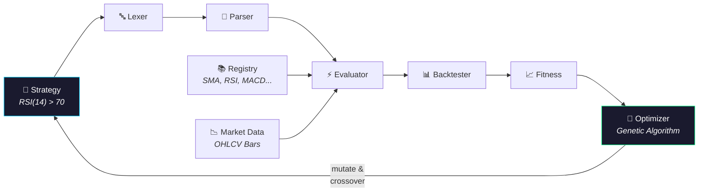

<p align="center">
  <h1 align="center">📈 LECAT</h1>
  <p align="center">
    <strong>Logical Expression Compiler for Algorithmic Trading</strong>
  </p>
  <p align="center">
    A DSL compiler that turns plain-English trading rules into executable strategies,<br>
    then evolves them using a genetic algorithm to find what actually works.
  </p>
  <p align="center">
    
    
    
    
  </p>
</p>

---

## ✨ Features

| Feature | Description |
|---------|-------------|
| 🧠 **DSL Compiler** | Write strategies like `RSI(14) > 70 AND PRICE > SMA(50)` — no code needed |
| ⏪ **Time-Travel** | Look back in time with `[n]` offsets: `EMA(10)[1] <= EMA(50)[1]` for crossover detection |
| 🧬 **Genetic Engine** | Automatically evolve profitable strategies via mutation, crossover, and tournament selection |
| 📊 **Web Dashboard** | Interactive Streamlit GUI with Plotly candlestick charts, metrics, and strategy presets |
| ⚡ **Parallel Evaluation** | Multi-core backtesting via ThreadPoolExecutor for 2–6x speedup |
| 📈 **8 Built-in Indicators** | SMA, EMA, RSI, ATR, MACD, Bollinger Bands, Stochastic Oscillator |
| 🔁 **Walk-Forward Validation** | Train/test split prevents overfitting; overfit ratio measures generalization |
| 💾 **Strategy Persistence** | Save and load strategies as JSON for sharing and reproducibility |

---

## 🚀 Quickstart

```bash
# 1. Clone & install
git clone <repository-url> && cd stockstats-lecat
pip install -r requirements.txt

# 2. Launch the dashboard
streamlit run lecat/dashboard/app.py

# 3. Or run from the command line
python -m lecat.main --generations 10 --strategies 100 --cores 4
```

---

## 🖥️ Dashboard

<!-- Screenshot placeholder -->
<!--  -->

The interactive web dashboard provides two modes:

**🔬 Strategy Lab** — Type any expression, click Run, and see an interactive candlestick chart with buy/sell signal markers, metrics (Return, Sharpe, Win Rate, Drawdown), and a JSON download button.

**🧬 Evolution Engine** — Configure the genetic algorithm (generations, population, mutation rate, train/test split), click Start, and watch the Hall of Fame populate with the best strategies found.

---

## 📝 The Language

LECAT uses a simple, expressive DSL for writing trading strategies:

```
RSI(14) > 70 AND PRICE > SMA(50)
```

### Operators
```
AND  OR  NOT                    # Boolean logic
>  <  >=  <=  ==  !=            # Comparisons
```

### Market Data
```
PRICE  OPEN  HIGH  LOW  VOLUME  # Current bar values
```

### Indicators
```
SMA(20)                         # Simple Moving Average
EMA(20)                         # Exponential Moving Average
RSI(14)                         # Relative Strength Index (0–100)
ATR(14)                         # Average True Range
MACD(12, 26, 9)                 # MACD Histogram
BB_UPPER(20, 2.0)               # Bollinger Band Upper
BB_LOWER(20, 2.0)               # Bollinger Band Lower
STOCH(14, 3)                    # Stochastic Oscillator %D (0–100)
```

### Time Travel (Context Shifting)
```
PRICE[1]                        # Yesterday's close
RSI(14)[3]                      # RSI from 3 bars ago
(EMA(10) > EMA(50))[1]          # Was fast EMA above slow EMA yesterday?
```

### Example Strategies
```
RSI(14) < 30 AND PRICE < BB_LOWER(20, 2.0)          # Mean reversion
EMA(10) > EMA(50) AND EMA(10)[1] <= EMA(50)[1]      # Golden crossover
MACD(12, 26, 9) > 0 AND RSI(14) > 50 AND RSI(14) < 80  # Momentum filter
```

---

## 🏗️ Architecture



The compiler pipeline: **String → Tokens → AST → Evaluator → Signals → Fitness**. The genetic optimizer closes the loop by evolving new strategy strings from the fittest individuals.

---

## 📁 Project Structure

```
stockstats-lecat/
├── lecat/                        # Core engine (stdlib only)
│   ├── lexer.py                  # Tokenizer
│   ├── parser.py                 # Recursive descent parser
│   ├── ast_nodes.py              # Immutable AST nodes
│   ├── evaluator.py              # Tree-walking evaluator
│   ├── context.py                # MarketContext (OHLCV + split)
│   ├── registry.py               # Function plugin registry
│   ├── std_lib.py                # Built-in indicators
│   ├── indicators.py             # Extended indicators (MACD, BB, STOCH)
│   ├── cache.py                  # Cross-bar indicator memoization
│   ├── generator.py              # Random expression generator
│   ├── backtester.py             # Time-loop backtesting engine
│   ├── fitness.py                # PnL, Sharpe, fitness scoring
│   ├── evolution.py              # Genetic operators
│   ├── optimizer.py              # GA loop + walk-forward
│   ├── parallel.py               # Multi-core batch evaluator
│   ├── data_loader.py            # CSV ingestion
│   ├── reporting.py              # Equity curve charts
│   ├── exporter.py               # Strategy JSON save/load
│   ├── logger.py                 # Structured logging
│   ├── main.py                   # CLI entry point
│   └── dashboard/
│       └── app.py                # Streamlit web dashboard
├── tests/                        # 235 unit tests
│   ├── test_lexer.py             # 31 tests
│   ├── test_parser.py            # 39 tests
│   ├── test_registry.py          # 15 tests
│   ├── test_evaluator.py         # 41 tests
│   ├── test_generator.py         # 10 tests
│   ├── test_backtester.py        # 14 tests
│   ├── test_fitness.py           # 10 tests
│   ├── test_evolution.py         # 18 tests
│   ├── test_data_loader.py       # 12 tests
│   ├── test_reporting.py         # 8 tests
│   ├── test_indicators.py        # 13 tests
│   ├── test_parallel.py          # 9 tests
│   └── test_persistence.py       # 15 tests
├── docs/                         # Documentation (SDD/SRS)
│   ├── 00_Overview.md
│   ├── 01_Grammar_Specification.md
│   ├── 02_System_Architecture.md
│   ├── 03_Function_Registry_API.md
│   ├── 04_Error_Handling.md
│   ├── 05_Integration_Strategy.md
│   └── 06_Operations_Manual.md
├── pyproject.toml                # Python packaging
├── requirements.txt              # Dependencies
├── Makefile                      # Developer shortcuts
├── LICENSE                       # MIT License
└── .gitignore
```

---

## 🛠️ Development

```bash
# Install with dev tools
pip install -e ".[all,dev]"

# Run tests
make test

# Format code
make format

# Launch dashboard
make run

# Clean build artifacts
make clean
```

See the full [Operations Manual](docs/06_Operations_Manual.md) for detailed usage, expression language reference, troubleshooting, and more.

---

## 📊 Project Status

| Phase | Sprint | Status |
|-------|--------|--------|
| **Phase 1** — Requirements & Specification | — | ✅ Complete |
| **Phase 2** — Core Implementation | Sprint 1 — Compiler Frontend | ✅ Complete |
| **Phase 2** — Core Implementation | Sprint 2 — Evaluator & Registry | ✅ Complete |
| **Phase 2** — Core Implementation | Sprint 3 — Backtester & Generator | ✅ Complete |
| **Phase 3** — Optimization & Evolution | Sprint 1 — Genetic Engine | ✅ Complete |
| **Phase 3** — Optimization & Evolution | Sprint 2 — Data & Validation | ✅ Complete |
| **Phase 3** — Optimization & Evolution | Sprint 3 — Performance & Indicators | ✅ Complete |
| **Phase 4** — Interface & Deployment | Sprint 1 — Web Dashboard | ✅ Complete |
| **Phase 4** — Interface & Deployment | Sprint 2 — Persistence & Packaging | ✅ Complete |
| **Phase 5** — Release Engineering | Final Polish & Handoff | ✅ Complete |

---

## 📄 License

MIT License — see [LICENSE](LICENSE) for details.