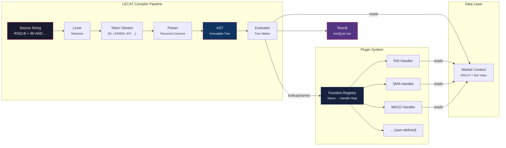
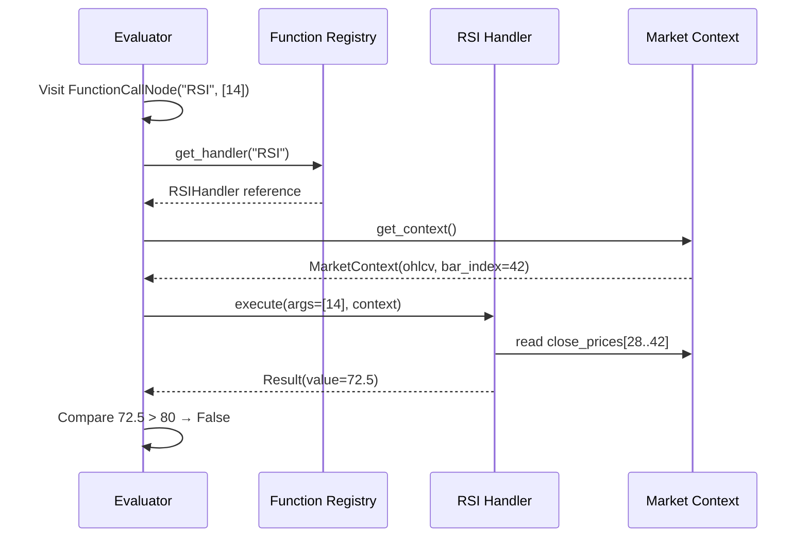
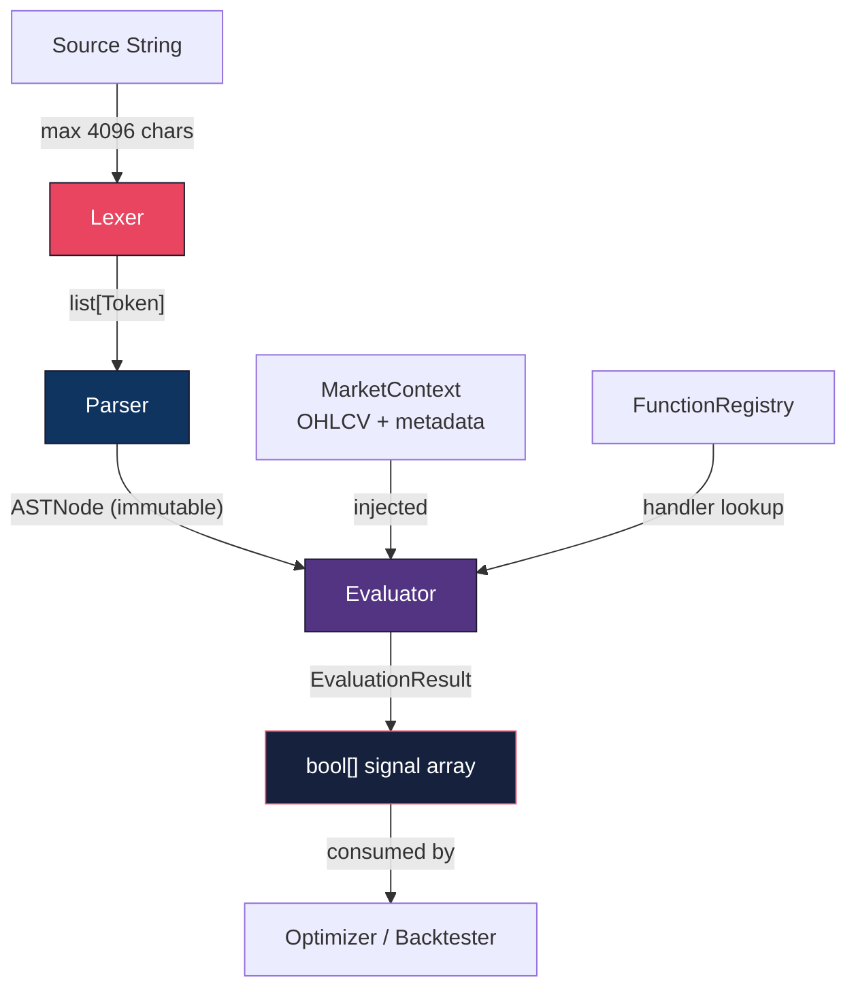

# B. System Architecture Design

**Standards:** C4 Model (Context, Containers, Components)
**Parent Document:** [Overview](./00_Overview.md)

---

## 1. High-Level Pipeline

The LECAT compiler follows a classic **four-stage pipeline**. Each stage is a pure function with well-defined input/output contracts.

```
┌──────────────┐    ┌─────────┐    ┌──────────┐    ┌───────────┐    ┌────────────┐
│ Source String │───▶│  Lexer  │───▶│  Parser  │───▶│    AST    │───▶│ Evaluator  │
│  (raw text)  │    │         │    │          │    │(immutable)│    │            │
└──────────────┘    └─────────┘    └──────────┘    └───────────┘    └────────────┘
                                                                          │
                                                                          ▼
                                                                   ┌────────────┐
                                                                   │  Registry  │
                                                                   │ (plugins)  │
                                                                   └────────────┘
```

---

## 2. Component Diagram (Mermaid)



---

## 3. Registry Pattern — Sequence Diagram



---

## 4. AST Node Definitions

The AST is a **tagged union** of node types. Every node is immutable once constructed.

### 4.1 Node Type Enumeration

```python
class NodeType(Enum):
    BINARY_OP      = "binary_op"
    UNARY_OP       = "unary_op"
    COMPARISON     = "comparison"
    FUNCTION_CALL  = "function_call"
    LITERAL        = "literal"
    IDENTIFIER     = "identifier"
    OFFSET         = "offset"         # CR-001: Context Shifting
```

### 4.2 Node Schemas (JSON Representation)

#### BinaryOpNode
Represents `AND` / `OR` operations.
```json
{
  "type": "binary_op",
  "operator": "AND",
  "left": { "...child node..." },
  "right": { "...child node..." }
}
```

#### UnaryOpNode
Represents `NOT` and unary `-`.
```json
{
  "type": "unary_op",
  "operator": "NOT",
  "operand": { "...child node..." }
}
```

#### ComparisonNode
Represents `>`, `<`, `>=`, `<=`, `==`, `!=`.
```json
{
  "type": "comparison",
  "operator": ">=",
  "left": { "...child node..." },
  "right": { "...child node..." }
}
```

#### FunctionCallNode
Represents `RSI(14)`, `MACD(12, 26, 9)`, etc.
```json
{
  "type": "function_call",
  "name": "RSI",
  "arguments": [
    { "type": "literal", "value": 14, "value_type": "integer" }
  ]
}
```

#### LiteralNode
Represents `42`, `3.14`, `TRUE`.
```json
{
  "type": "literal",
  "value": 80,
  "value_type": "integer"
}
```
Valid `value_type` values: `"integer"`, `"float"`, `"boolean"`.

#### IdentifierNode
Represents bare names like `PRICE`, `VOLUME` (resolved via Registry as zero-arg functions).
```json
{
  "type": "identifier",
  "name": "PRICE"
}
```

#### OffsetNode *(CR-001)*
Represents a time-shifted evaluation (e.g., `RSI(14)[1]` — "RSI 1 bar ago").
```json
{
  "type": "offset",
  "shift_amount": 1,
  "child": { "...child node..." }
}
```

**Constraints:**
- `shift_amount` must be a non-negative integer (enforced by Parser).
- `shift_amount = 0` is semantically a no-op (identity).
- The `child` node is evaluated with `bar_index - shift_amount`.

### 4.3 Complete AST Example

Expression: `RSI(14) > 80 AND PRICE > SMA(50)`

```json
{
  "type": "binary_op",
  "operator": "AND",
  "left": {
    "type": "comparison",
    "operator": ">",
    "left": {
      "type": "function_call",
      "name": "RSI",
      "arguments": [
        { "type": "literal", "value": 14, "value_type": "integer" }
      ]
    },
    "right": {
      "type": "literal",
      "value": 80,
      "value_type": "integer"
    }
  },
  "right": {
    "type": "comparison",
    "operator": ">",
    "left": {
      "type": "identifier",
      "name": "PRICE"
    },
    "right": {
      "type": "function_call",
      "name": "SMA",
      "arguments": [
        { "type": "literal", "value": 50, "value_type": "integer" }
      ]
    }
  }
}
```

---

## 5. Component Interface Contracts

### 5.1 Lexer

```python
class Lexer:
    """Converts source string into a stream of tokens."""

    def __init__(self, source: str) -> None: ...

    def tokenize(self) -> list[Token]: ...
```

**Input:** Raw source string (max 4096 characters)
**Output:** Ordered list of `Token` objects
**Errors:** `LexerError` on unrecognized characters

### 5.2 Token

```python
@dataclass(frozen=True)
class Token:
    type: TokenType       # e.g., INTEGER, IDENTIFIER, AND
    value: str | int | float | bool
    position: int         # Character offset in source string
    line: int             # Line number (for multi-line future support)
```

### 5.3 Parser

```python
class Parser:
    """Converts token stream into an immutable AST."""

    def __init__(self, tokens: list[Token]) -> None: ...

    def parse(self) -> ASTNode: ...
```

**Input:** Token list from Lexer
**Output:** Root `ASTNode` of the immutable AST
**Errors:** `ParserError` on syntax violations (unexpected token, unmatched parens, etc.)

### 5.4 Evaluator

```python
class Evaluator:
    """Walks the AST and evaluates it against market data."""

    def __init__(self, registry: FunctionRegistry) -> None: ...

    def evaluate(
        self,
        ast: ASTNode,
        context: MarketContext
    ) -> EvaluationResult: ...
```

**Input:** Immutable AST + MarketContext
**Output:** `EvaluationResult` containing a boolean array (one value per bar)
**Errors:** `EvaluationError` on runtime failures (see [Error Handling](./04_Error_Handling.md))

**Handling Offsets (CR-001):**

When visiting an `OffsetNode`, the Evaluator must:
1. Calculate `past_index = context.bar_index - node.shift_amount`.
2. If `past_index < 0`, return `FunctionResult.insufficient_data()`.
3. Create a **shallow copy** of the context: `temp_ctx = context.with_index(past_index)`.
4. Recursively call `evaluate(node.child, temp_ctx)`.

```python
def visit_offset(self, node: OffsetNode, context: MarketContext):
    past_index = context.bar_index - node.shift_amount
    if past_index < 0:
        return FunctionResult.insufficient_data()
    shifted_ctx = context.with_index(past_index)
    return self.evaluate(node.child, shifted_ctx)
```

> **Caching Note (CR-001):** The Evaluator's function result cache key must now include `bar_index`.
> - *Old key:* `(function_name, args)`
> - *New key:* `(function_name, args, bar_index)`

---

## 6. Data Flow Summary


