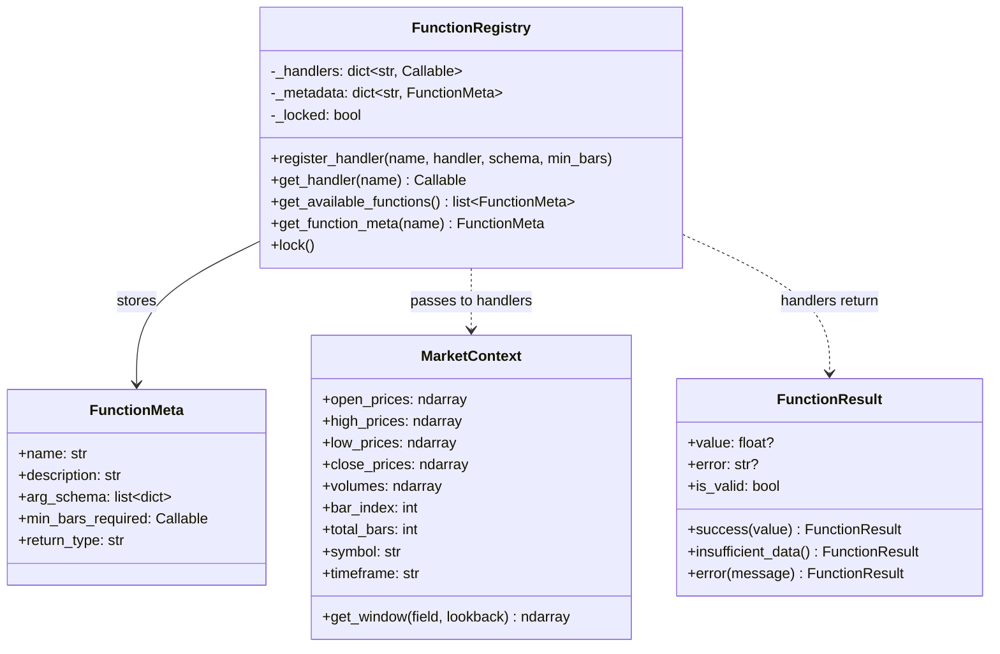

# C. Function Registry Interface API

**Parent Document:** [Overview](./00_Overview.md)
**Related:** [System Architecture](./02_System_Architecture.md)

---

## 1. Purpose

The Function Registry is the **plugin system** that makes LECAT expandable. It decouples the Evaluator from specific indicator implementations, allowing new functions (RSI, SMA, MACD, custom indicators) to be added without modifying the core compiler.

**Design Pattern:** Service Locator + Decorator Registration

---

## 2. Registration Mechanism

### 2.1 Decorator-Based Registration

Functions register themselves using a `@register` decorator. This is the **primary** registration method.

```python
from lecat.registry import register, MarketContext, FunctionResult

@register(
    name="RSI",
    description="Relative Strength Index",
    arg_schema=[
        {"name": "period", "type": "integer", "required": True, "default": 14}
    ],
    min_bars_required=lambda args: args["period"] + 1
)
def rsi_handler(args: dict, context: MarketContext) -> FunctionResult:
    """
    Compute RSI for the current bar.

    Args:
        args: {"period": 14}
        context: MarketContext with OHLCV data and current bar index

    Returns:
        FunctionResult with float value or error
    """
    period = args["period"]
    close = context.close_prices
    idx = context.bar_index

    # ... RSI calculation logic ...

    return FunctionResult(value=rsi_value)
```

### 2.2 Programmatic Registration

For dynamic registration (e.g., loading from config files):

```python
registry = FunctionRegistry()

registry.register_handler(
    name="CUSTOM_IND",
    handler=my_custom_function,
    arg_schema=[...],
    min_bars_required=lambda args: args.get("period", 20)
)
```

### 2.3 Registration Rules

| Rule | Description |
|------|------------|
| **Unique names** | Two functions cannot share the same name. Duplicate registration raises `RegistryError`. |
| **Case-sensitive** | `RSI` and `rsi` are different functions. Convention: uppercase names. |
| **Immutable after lock** | Once `registry.lock()` is called, no new registrations are accepted. The Evaluator calls `lock()` before evaluation begins. |
| **No side effects** | Registered handlers must be pure functions — no I/O, no global state mutation. |

---

## 3. Input/Output Contract

### 3.1 Handler Signature

Every registered function must conform to this signature:

```python
def handler(args: dict, context: MarketContext) -> FunctionResult:
    ...
```

### 3.2 `MarketContext` — The Data Window

The `MarketContext` is the **read-only** data object passed to every handler during evaluation.

```python
@dataclass(frozen=True)
class MarketContext:
    """Read-only market data for the current evaluation."""

    # --- Core OHLCV Data (full history up to current bar) ---
    open_prices:   ndarray   # shape: (num_bars,)
    high_prices:   ndarray   # shape: (num_bars,)
    low_prices:    ndarray   # shape: (num_bars,)
    close_prices:  ndarray   # shape: (num_bars,)
    volumes:       ndarray   # shape: (num_bars,)

    # --- Current Position ---
    bar_index:     int       # Current bar being evaluated (0-indexed)
    total_bars:    int       # Total number of bars in the dataset

    # --- Metadata ---
    symbol:        str       # e.g., "BTCUSD"
    timeframe:     str       # e.g., "1D", "4H", "1H"

    def get_window(self, field: str, lookback: int) -> ndarray:
        """
        Get a lookback window of data ending at bar_index.

        Args:
            field: One of "open", "high", "low", "close", "volume"
            lookback: Number of bars to look back

        Returns:
            ndarray of shape (lookback,)

        Raises:
            InsufficientDataError: if bar_index < lookback - 1
            LookAheadError: if accessing future bars
        """
        ...
```

**Critical Safety Features:**
- `frozen=True` ensures immutability
- `get_window()` enforces bounds — **no look-ahead bias is possible**
- Arrays are sliced up to `bar_index` only — future data is never exposed

### 3.3 `FunctionResult` — Standard Return Type

```python
@dataclass(frozen=True)
class FunctionResult:
    """Standard return type for all registry functions."""

    value: float | None      # The computed value (None = no data)
    error: str | None = None # Error message if computation failed
    is_valid: bool = True    # False if value should be treated as NaN

    @staticmethod
    def success(value: float) -> "FunctionResult":
        return FunctionResult(value=value, is_valid=True)

    @staticmethod
    def insufficient_data() -> "FunctionResult":
        return FunctionResult(value=None, is_valid=False, error="Insufficient data")

    @staticmethod
    def error(message: str) -> "FunctionResult":
        return FunctionResult(value=None, is_valid=False, error=message)
```

**Return Contract:**
| Scenario | Return |
|----------|--------|
| Successful computation | `FunctionResult.success(72.5)` |
| Not enough bars for lookback | `FunctionResult.insufficient_data()` |
| Division by zero in calculation | `FunctionResult.error("Division by zero in RSI")` |
| Invalid arguments | `FunctionResult.error("Period must be > 0")` |

---

## 4. Argument Schema Definition

Each function declares its expected arguments using a structured schema:

```python
arg_schema = [
    {
        "name": "period",          # Argument name (for introspection)
        "type": "integer",         # Expected type: "integer", "float", "boolean"
        "required": True,          # Is this argument mandatory?
        "default": 14,             # Default value if not provided
        "min": 1,                  # Minimum valid value (optional)
        "max": 500,                # Maximum valid value (optional)
        "description": "Lookback period for RSI calculation"
    }
]
```

**Type Validation:** Arguments are validated **at parse time** (static) and **at evaluation time** (runtime). Mismatched types produce a `TypeError` before execution.

---

## 5. Introspection API

The Registry exposes metadata for the **Optimizer/Generator** to build random expression trees:

```python
class FunctionRegistry:
    def get_available_functions(self) -> list[FunctionMeta]:
        """Return metadata for all registered functions."""
        ...

    def get_function_meta(self, name: str) -> FunctionMeta:
        """Return metadata for a specific function."""
        ...

    def get_handler(self, name: str) -> Callable:
        """Return the handler callable for evaluation."""
        ...

    def lock(self) -> None:
        """Prevent further registrations. Called before evaluation."""
        ...
```

```python
@dataclass(frozen=True)
class FunctionMeta:
    name: str                          # "RSI"
    description: str                   # "Relative Strength Index"
    arg_schema: list[dict]             # Argument definitions
    min_bars_required: Callable        # Dynamic minimum data requirement
    return_type: str                   # Always "float" for now
```

### Introspection Example (for Optimizer)

```python
# Optimizer queries available building blocks
registry = get_global_registry()
functions = registry.get_available_functions()

for fn in functions:
    print(f"{fn.name}({', '.join(a['name'] for a in fn.arg_schema)})")
    # Output: RSI(period), SMA(period), MACD(fast, slow, signal), ...
```

---

## 6. Built-In Functions (Phase 1)

These functions should be available in the initial implementation:

| Name | Arguments | Description | Min Bars |
|------|-----------|-------------|----------|
| `PRICE` | *(none)* | Current bar's close price | 1 |
| `OPEN` | *(none)* | Current bar's open price | 1 |
| `HIGH` | *(none)* | Current bar's high price | 1 |
| `LOW` | *(none)* | Current bar's low price | 1 |
| `VOLUME` | *(none)* | Current bar's volume | 1 |
| `SMA` | `period: int` | Simple Moving Average | `period` |
| `EMA` | `period: int` | Exponential Moving Average | `period` |
| `RSI` | `period: int` | Relative Strength Index | `period + 1` |
| `MACD` | `fast: int, slow: int, signal: int` | MACD line value | `slow + signal` |
| `ATR` | `period: int` | Average True Range | `period + 1` |
| `BBANDS_UPPER` | `period: int, std: float` | Bollinger Band upper | `period` |
| `BBANDS_LOWER` | `period: int, std: float` | Bollinger Band lower | `period` |

---

## 7. Registry Architecture Diagram


