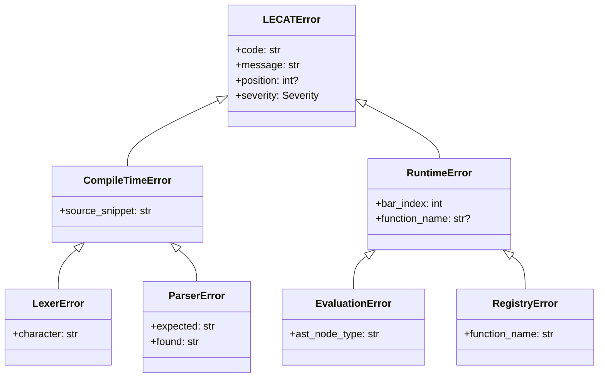
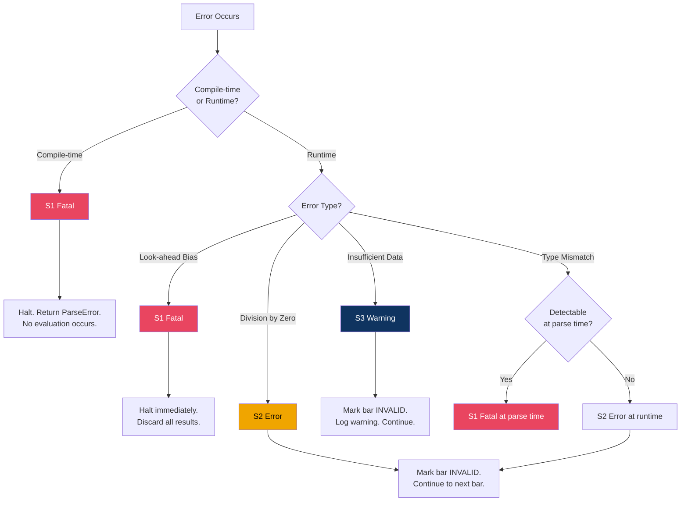

# D. Error Handling & Edge Cases — The "Safety Net"

**Parent Document:** [Overview](./00_Overview.md)
**Standard:** IEEE 830 — Requirements Classification (Severity / Priority)

---

## 1. Design Philosophy

> In financial trading, a crash is expensive.

The LECAT error handling strategy follows these principles:

1. **Fail fast at compile time** — Catch as many errors as possible during lexing/parsing, before any data is touched.
2. **Propagate gracefully at runtime** — Runtime errors (insufficient data, division by zero) produce `NaN`/invalid signals rather than crashes.
3. **Never silently corrupt** — Every error is logged with full context. No error is swallowed.
4. **No partial results** — An evaluation either produces a complete signal array or a clear error.

---

## 2. Error Taxonomy

### 2.1 Error Hierarchy



### 2.2 Severity Levels

| Level | Name | Behavior | Example |
|:-----:|------|----------|---------|
| **S1** | **Fatal** | Halt immediately. No result produced. | Syntax error, unregistered function |
| **S2** | **Error** | Mark current bar as invalid. Continue evaluation. | Division by zero, type mismatch |
| **S3** | **Warning** | Produce result but log warning. | Insufficient data for early bars |
| **S4** | **Info** | Log only. No impact on results. | Function cache hit statistics |

---

## 3. Compile-Time Errors (Lexer & Parser)

These are always **S1 Fatal** — the expression cannot be evaluated.

### 3.1 Lexer Errors

| Error Code | Condition | Example Input | Message |
|------------|-----------|---------------|---------|
| `LEX_001` | Unrecognized character | `RSI(14) @ 80` | `Unexpected character '@' at position 9` |
| `LEX_002` | Unterminated token | `3.` (trailing dot) | `Invalid number literal at position 0` |
| `LEX_003` | Input exceeds max length | *(> 4096 chars)* | `Expression exceeds maximum length of 4096 characters` |

### 3.2 Parser Errors

| Error Code | Condition | Example Input | Message |
|------------|-----------|---------------|---------|
| `PAR_001` | Unexpected token | `RSI > > 80` | `Expected expression, found '>' at position 6` |
| `PAR_002` | Unmatched parenthesis | `RSI(14 > 80` | `Expected ')' at position 7, found '>'` |
| `PAR_003` | Chained comparison | `A > B > C` | `Comparison operators are non-associative` |
| `PAR_004` | Empty expression | *(empty string)* | `Empty expression` |
| `PAR_005` | Max nesting exceeded | *(256+ levels)* | `Maximum nesting depth of 256 exceeded` |
| `PAR_006` | Missing function args | `MACD()` → if args required | `Function 'MACD' requires at least 3 arguments` |
| `PAR_007` | Trailing tokens | `RSI(14) > 80 extra` | `Unexpected token 'extra' after expression end` |

---

## 4. Runtime Errors (Evaluator)

### 4.1 Division by Zero

| Aspect | Specification |
|--------|---------------|
| **Severity** | S2 — Error |
| **Error Code** | `EVAL_001` |
| **Behavior** | Return `FunctionResult.error("Division by zero")`. The comparison node containing this result evaluates to `False`. The bar is marked as `invalid` in the signal array. |
| **Rationale** | Halting the entire evaluation for a single bar's division by zero would waste the investment in processing all other bars. |

**Example:**
```
Custom indicator: price_change = (close - prev_close) / prev_close
If prev_close == 0 (e.g., missing data):
  → FunctionResult.error("Division by zero in PRICE_CHANGE at bar 42")
  → Comparison result: False (invalid)
  → Signal[42] = INVALID
```

### 4.2 Look-Ahead Bias

| Aspect | Specification |
|--------|---------------|
| **Severity** | S1 — Fatal |
| **Error Code** | `EVAL_002` |
| **Behavior** | **Hard error. Halt evaluation immediately.** |
| **Rationale** | Look-ahead bias produces misleading backtest results. This is a critical bug in the indicator, not a recoverable condition. |

**Prevention Mechanism:**
- The `MarketContext.get_window()` method only allows access to indices `[0..bar_index]`.
- Any attempt to access `bar_index + 1` or beyond raises `LookAheadError`.
- This is enforced at the data layer, not the function layer — making it impossible to bypass.

```python
# Inside MarketContext.get_window()
if start_index > self.bar_index or end_index > self.bar_index:
    raise LookAheadError(
        f"Attempted to access bar {end_index} while evaluating bar {self.bar_index}. "
        f"Look-ahead bias detected."
    )
```

### 4.3 Insufficient Data

| Aspect | Specification |
|--------|---------------|
| **Severity** | S3 — Warning |
| **Error Code** | `EVAL_003` |
| **Behavior** | Return `FunctionResult.insufficient_data()`. The bar is marked as `INVALID` in the signal array. Evaluation continues for subsequent bars. |
| **Rationale** | This is expected behavior for the first N bars (where N = indicator lookback period). It is not an error, just an unavoidable data gap. |

**Example:**
```
Expression: SMA(200) > 50000
Bar index: 49 (only 50 bars available)
SMA(200) requires 200 bars → insufficient data
  → FunctionResult.insufficient_data()
  → Signal[49] = INVALID
  → Log: "Warning [EVAL_003]: SMA(200) insufficient data at bar 49 (need 200, have 50)"
```

**Warm-Up Period Calculation:**
```python
def calculate_warmup(ast: ASTNode, registry: FunctionRegistry) -> int:
    """
    Walk the AST and determine the maximum lookback required.
    Bars before this index will have INVALID signals.
    """
    if isinstance(ast, FunctionCallNode):
        meta = registry.get_function_meta(ast.name)
        return meta.min_bars_required(ast.resolved_args)
    elif isinstance(ast, BinaryOpNode):
        return max(
            calculate_warmup(ast.left, registry),
            calculate_warmup(ast.right, registry)
        )
    # ... recurse for other node types
    return 0
```

### 4.4 Type Mismatch

| Aspect | Specification |
|--------|---------------|
| **Severity** | S1 — Fatal (static), S2 — Error (runtime) |
| **Error Code** | `EVAL_004` |
| **Behavior** | **Static check (preferred):** Parser validates operand compatibility at parse time. **Runtime check (fallback):** If types are only known at evaluation time, produce an error for that bar. |
| **Rationale** | Type mismatches indicate a logic error in the expression, not a data issue. |

**Type Compatibility Matrix:**

| Left Type | Operator | Right Type | Valid? | Result Type |
|-----------|----------|------------|:------:|-------------|
| `float` | `>` `<` `>=` `<=` `==` `!=` | `float` | ✅ | `bool` |
| `float` | `>` `<` `>=` `<=` `==` `!=` | `int` | ✅ | `bool` (int promoted to float) |
| `bool` | `AND` `OR` | `bool` | ✅ | `bool` |
| `bool` | `>` `<` | `float` | ❌ | `TypeError` |
| `float` | `AND` `OR` | `float` | ❌ | `TypeError` |
| `bool` | `AND` `OR` | `float` | ❌ | `TypeError` |
| any | `NOT` (unary) | — | only `bool` | `bool` |
| any | `-` (unary) | — | only `float`/`int` | `float` |

---

## 5. Error Reporting Format

All errors produce a structured `LECATError` object:

```json
{
  "code": "EVAL_001",
  "severity": "S2",
  "message": "Division by zero in RSI calculation",
  "context": {
    "bar_index": 42,
    "function_name": "RSI",
    "expression_fragment": "RSI(14)",
    "source_position": 0
  },
  "timestamp": "2026-03-03T01:25:00Z"
}
```

---

## 6. Error Behavior Summary


