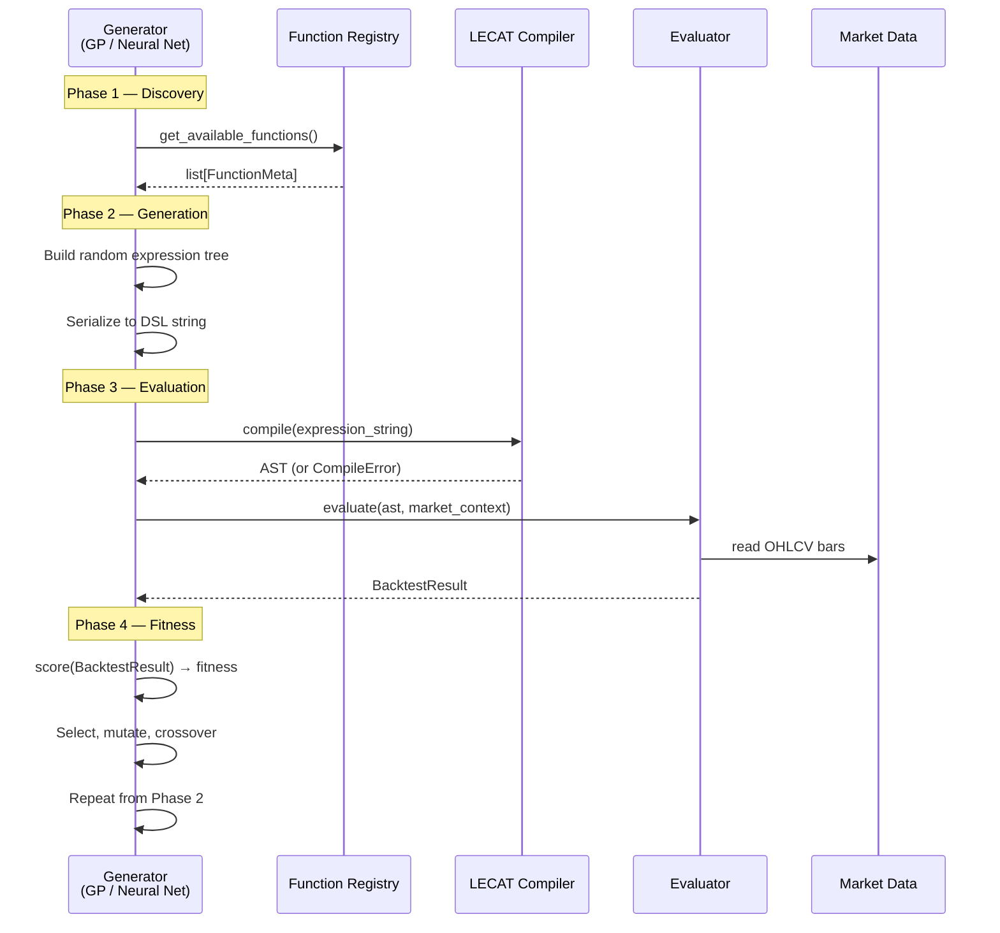
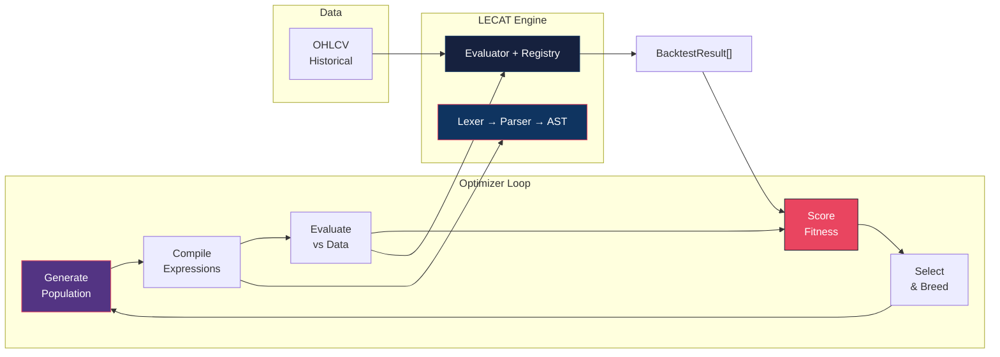

# E. Integration Strategy — The "Optimizer Hook"

**Parent Document:** [Overview](./00_Overview.md)
**Related:** [Function Registry API](./03_Function_Registry_API.md)

---

## 1. Purpose

The LECAT compiler's primary consumer is a **Genetic Programming (GP) / Neural Network optimization loop**. This document defines the interface between the optimizer (the "Generator") and the LECAT evaluation engine, enabling the optimizer to:

1. **Discover** available functions and their argument schemas.
2. **Generate** syntactically valid, random expression trees.
3. **Evaluate** candidate expressions against historical data.
4. **Receive** structured fitness results.

---

## 2. Integration Architecture



---

## 3. Discovery Interface

The optimizer queries the registry to learn what building blocks are available:

```python
class OptimizerInterface:
    """Interface exposed to the GP/Neural generator."""

    def __init__(self, registry: FunctionRegistry):
        self.registry = registry

    def get_building_blocks(self) -> BuildingBlocks:
        """
        Return all available components for tree generation.

        Returns:
            BuildingBlocks containing functions, operators, and constraints.
        """
        return BuildingBlocks(
            functions=self.registry.get_available_functions(),
            comparison_ops=["<", ">", "<=", ">=", "==", "!="],
            logical_ops=["AND", "OR"],
            unary_ops=["NOT"],
            max_depth=256,
            max_expression_length=4096,
        )
```

```python
@dataclass(frozen=True)
class BuildingBlocks:
    """Available components for expression tree generation."""

    functions: list[FunctionMeta]      # RSI, SMA, MACD, ...
    comparison_ops: list[str]          # >, <, ==, ...
    logical_ops: list[str]             # AND, OR
    unary_ops: list[str]               # NOT
    max_depth: int                     # 256
    max_expression_length: int         # 4096 chars
```

---

## 4. Expression Generation Contract

The Generator is responsible for producing **syntactically valid** expressions. LECAT provides helper utilities but does **not** own the generation logic.

### 4.1 Random Tree Generation (Helper)

```python
class ExpressionGenerator:
    """Helper to generate random, valid LECAT expressions."""

    def __init__(self, blocks: BuildingBlocks, rng_seed: int):
        self.blocks = blocks
        self.rng = Random(rng_seed)  # Deterministic RNG

    def generate(self, max_depth: int = 5) -> str:
        """
        Generate a random but syntactically valid expression.

        Args:
            max_depth: Maximum tree depth for this expression

        Returns:
            A valid LECAT DSL expression string.
        """
        ast = self._build_tree(depth=0, max_depth=max_depth)
        return self._serialize(ast)

    def _build_tree(self, depth: int, max_depth: int) -> ASTNode:
        """Recursively build a random AST."""
        if depth >= max_depth:
            # At max depth, generate a leaf (function call or literal)
            return self._random_leaf()

        # Choose structure type
        choice = self.rng.choice(["comparison", "logical", "leaf"])

        if choice == "comparison":
            left = self._random_function_call()
            op = self.rng.choice(self.blocks.comparison_ops)
            right = self._random_numeric_value(left)
            return ComparisonNode(op=op, left=left, right=right)

        elif choice == "logical":
            op = self.rng.choice(self.blocks.logical_ops)
            left = self._build_tree(depth + 1, max_depth)
            right = self._build_tree(depth + 1, max_depth)
            return BinaryOpNode(op=op, left=left, right=right)

        else:
            return self._random_leaf()

    def _random_function_call(self) -> FunctionCallNode:
        """Generate a random function call with valid arguments."""
        fn = self.rng.choice(self.blocks.functions)
        args = []
        for schema in fn.arg_schema:
            if schema["type"] == "integer":
                val = self.rng.randint(schema.get("min", 1), schema.get("max", 200))
            elif schema["type"] == "float":
                val = self.rng.uniform(schema.get("min", 0.1), schema.get("max", 5.0))
            args.append(LiteralNode(value=val))
        return FunctionCallNode(name=fn.name, arguments=args)

    # ... _random_leaf, _random_numeric_value, _serialize methods ...
```

### 4.2 Genetic Operations

The optimizer must support these standard GP operations:

| Operation | Description | LECAT Constraint |
|-----------|-------------|------------------|
| **Crossover** | Swap subtrees between two parent expressions | Result must respect `max_depth` limit |
| **Mutation** | Replace a random subtree with a new random subtree | Must remain syntactically valid |
| **Reproduction** | Copy an expression unchanged to the next generation | No constraints |
| **Simplification** | Reduce redundant nodes (e.g., `NOT NOT X` → `X`) | Must preserve semantic equivalence |

---

## 5. `BacktestResult` — The Fitness Input

The Evaluator returns a `BacktestResult` to the optimizer. This is the raw material for fitness scoring.

### 5.1 Schema

```python
@dataclass(frozen=True)
class BacktestResult:
    """Result of evaluating a LECAT expression against market data."""

    # --- Signal Array ---
    signals: ndarray             # dtype: int8, shape: (num_bars,)
                                 # Values: 1 = True, 0 = False, -1 = INVALID

    # --- Metadata ---
    expression: str              # The original DSL expression string
    total_bars: int              # Total bars in the dataset
    valid_bars: int              # Bars with valid (non-INVALID) signals
    invalid_bars: int            # Bars with INVALID signals (warmup / errors)
    warmup_period: int           # Number of initial bars skipped (insufficient data)

    # --- Timing ---
    compile_time_ms: float       # Time to lex + parse (milliseconds)
    evaluation_time_ms: float    # Time to evaluate across all bars (milliseconds)

    # --- Errors ---
    errors: list[LECATError]     # All runtime errors encountered
    has_fatal_error: bool        # True if evaluation was halted early

    # --- Signal Statistics ---
    true_count: int              # Number of bars where signal = True
    false_count: int             # Number of bars where signal = False
    true_ratio: float            # true_count / valid_bars
```

### 5.2 Signal Values

| Value | Meaning | When Produced |
|:-----:|---------|---------------|
| `1` | **True** — Condition met for this bar | Expression evaluates to True |
| `0` | **False** — Condition not met | Expression evaluates to False |
| `-1` | **Invalid** — No signal available | Insufficient data, division by zero, etc. |

### 5.3 JSON Export Format

```json
{
  "expression": "RSI(14) > 80 AND PRICE > SMA(50)",
  "total_bars": 1000,
  "valid_bars": 950,
  "invalid_bars": 50,
  "warmup_period": 50,
  "compile_time_ms": 0.12,
  "evaluation_time_ms": 3.45,
  "has_fatal_error": false,
  "true_count": 127,
  "false_count": 823,
  "true_ratio": 0.1337,
  "signals": [
    -1, -1, -1, "...(warmup)...", 0, 0, 1, 0, 1, 1, 0, "..."
  ],
  "errors": []
}
```

---

## 6. Evaluation Pipeline Interface

### 6.1 Compile & Evaluate (Convenience)

```python
class LECATEngine:
    """Top-level interface for the optimizer."""

    def __init__(self, registry: FunctionRegistry):
        self.lexer_class = Lexer
        self.parser_class = Parser
        self.evaluator = Evaluator(registry)

    def compile(self, expression: str) -> CompileResult:
        """
        Lex and parse an expression into an AST.

        Returns:
            CompileResult with AST on success, or errors on failure.
        """
        try:
            tokens = self.lexer_class(expression).tokenize()
            ast = self.parser_class(tokens).parse()
            return CompileResult(ast=ast, success=True)
        except LECATError as e:
            return CompileResult(ast=None, success=False, error=e)

    def evaluate(self, ast: ASTNode, context: MarketContext) -> BacktestResult:
        """
        Evaluate a compiled AST against market data.

        Returns:
            BacktestResult with signal array and metadata.
        """
        return self.evaluator.evaluate(ast, context)

    def compile_and_evaluate(
        self,
        expression: str,
        context: MarketContext
    ) -> BacktestResult:
        """Convenience: compile + evaluate in one call."""
        result = self.compile(expression)
        if not result.success:
            return BacktestResult.failed(expression, result.error)
        return self.evaluate(result.ast, context)
```

### 6.2 Batch Evaluation (for Population)

```python
class BatchEvaluator:
    """Evaluate an entire population of expressions efficiently."""

    def __init__(self, engine: LECATEngine, context: MarketContext):
        self.engine = engine
        self.context = context

    def evaluate_population(
        self,
        expressions: list[str],
        parallel: bool = True,
        max_workers: int = 4
    ) -> list[BacktestResult]:
        """
        Evaluate multiple expressions against the same dataset.

        Args:
            expressions: List of DSL expression strings
            parallel: Whether to use concurrent evaluation
            max_workers: Maximum number of parallel workers

        Returns:
            List of BacktestResults in the same order as input.

        Note:
            Each expression is evaluated independently.
            Shared MarketContext is read-only, so concurrent access is safe.
        """
        ...
```

---

## 7. Performance Considerations

| Concern | Mitigation |
|---------|------------|
| **Redundant function calls** | Per-bar function result caching. `SMA(50)` called twice in one expression computes once. |
| **Large populations** | Batch evaluator with parallel execution. MarketContext is immutable, so thread-safe. |
| **Deep expressions** | Recursion depth limit (256). Iterative tree walk can be used as alternative. |
| **Memory pressure** | Signal arrays use `int8` (1 byte per bar). 1M bars = 1MB per expression. |
| **Hot path optimization** | AST can be pre-compiled into a flat instruction array for stack-machine evaluation (Phase 2 optimization). |

---

## 8. Integration Flow Diagram


