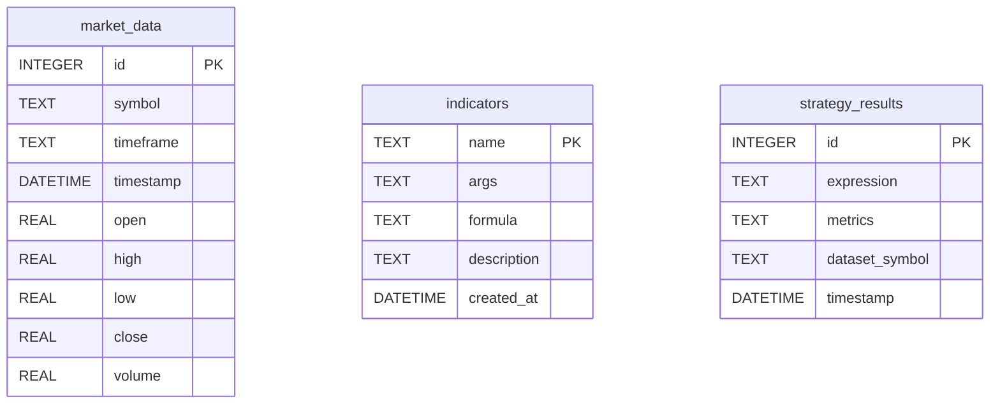

# Database Schema Reference

> LECAT v2.0.0 — Phase 6: Data & Extensibility

This document describes the SQLite database schema used by LECAT for persisting market data, custom indicators, and optimization results.

## Overview

LECAT uses a single SQLite database file (`lecat.db`) stored in the project root. The schema is automatically created on first use by the `Repository` class.



---

## Tables

### 1. `market_data` — Raw OHLCV Data

Stores uploaded or imported financial time-series data.

| Column    | Type     | Notes                                      |
|-----------|----------|--------------------------------------------|
| id        | INTEGER  | Auto-incrementing primary key              |
| symbol    | TEXT     | Ticker symbol (e.g., `BTC_USD`)            |
| timeframe | TEXT     | Candle period, default `1D`                |
| timestamp | DATETIME | Bar timestamp                              |
| open      | REAL     | Open price                                 |
| high      | REAL     | High price                                 |
| low       | REAL     | Low price                                  |
| close     | REAL     | Close price                                |
| volume    | REAL     | Trading volume                             |

**Unique constraint:** `(symbol, timeframe, timestamp)` — prevents duplicate bars.

**Index:** `idx_market_data_symbol` on `(symbol, timeframe)` for fast lookups.

---

### 2. `indicators` — Custom DSL Indicators

Stores user-created indicators that extend the LECAT function library.

| Column      | Type     | Notes                                      |
|-------------|----------|--------------------------------------------|
| name        | TEXT     | Primary key (e.g., `AVG_PRICE`)            |
| args        | TEXT     | JSON array of argument names               |
| formula     | TEXT     | LECAT DSL expression                       |
| description | TEXT     | Human-readable description                 |
| created_at  | DATETIME | Auto-populated on creation                 |

**Example row:**
```json
{
  "name": "MY_CROSS",
  "args": "[\"fast\", \"slow\"]",
  "formula": "SMA(fast) > SMA(slow)",
  "description": "Detects a fast/slow SMA crossover"
}
```

---

### 3. `strategy_results` — Optimization History

Stores backtesting and optimization results for later analysis.

| Column         | Type     | Notes                                    |
|----------------|----------|------------------------------------------|
| id             | INTEGER  | Auto-incrementing primary key            |
| expression     | TEXT     | LECAT strategy expression                |
| metrics        | TEXT     | JSON object with fitness metrics         |
| dataset_symbol | TEXT     | Symbol the strategy was tested on        |
| timestamp      | DATETIME | Auto-populated on insertion              |

**Index:** `idx_strategy_results_timestamp` on `(timestamp DESC)` for recent-first queries.

---

## Usage

```python
from lecat.repository import Repository

# Default location: lecat.db in project root
repo = Repository()

# Save market data
repo.save_market_data(rows, "BTC_USD")

# List available symbols
symbols = repo.get_symbols()

# Save a custom indicator
repo.save_indicator("AVG_PRICE", [], "(HIGH + LOW) / 2", "Average of H+L")

# Log optimization results
repo.save_result("RSI(14) > 70", {"sharpe": 1.5, "return_pct": 20.4})
```

## Backup

The database is a single file. To back up:
```bash
cp lecat.db lecat_backup_$(date +%Y%m%d).db
```
